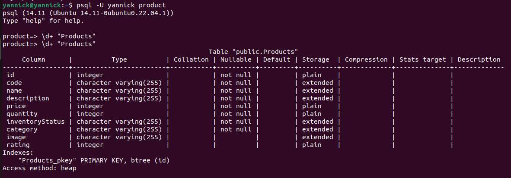

# Back-end

Back-end permettant la gestion de produits définis plus bas.

  - Technologie: nodejs/express
  - SGBD: Postgresql

Le back-end gère les API REST suivantes : 

| Resource           | POST                  | GET                            | PATCH                                    | PUT | DELETE           |
| ------------------ | --------------------- | ------------------------------ | ---------------------------------------- | --- | ---------------- |
| **/products**      | Create a new products | Retrieve all products          | X                                        | X   |     X            |
| **/products/1**    | X                     | Retrieve details for product 1 | Update details of product 1 if it exists | X   | Remove product 1 |

Un produit a les caractéristiques suivantes : 

``` typescript
class Product {
  id: number;
  code: string;
  name: string;
  description: string;
  price: number;
  quantity: number;
  inventoryStatus: string;
  category: string;
  image?: string;
  rating?: number;
}
```

[Lien vers la doc Postman et les tests](https://documenter.getpostman.com/view/25420143/2sA35D43Q2).

## Description de la relation Products


## Liste des produits dans Products


Pour lancer l'application, utilisez la commande 'node app.js'. 
Installez les dépendances nécessaires pour le projet avec 'npm install' 

